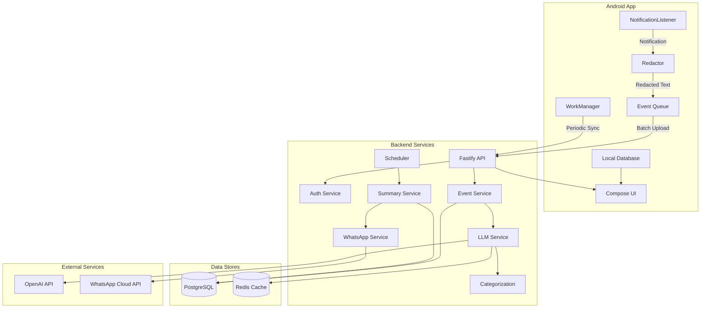
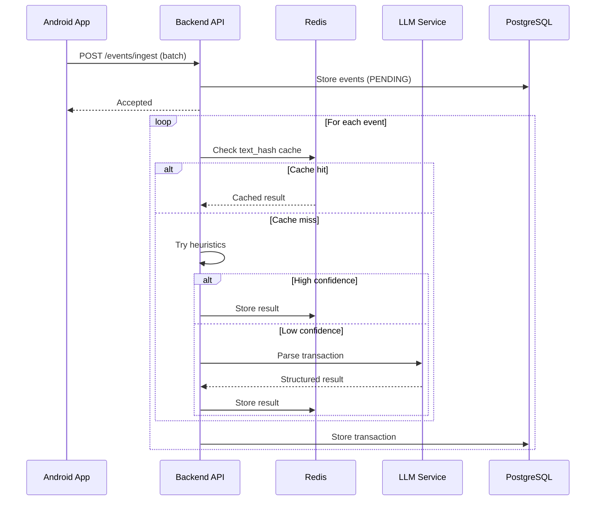
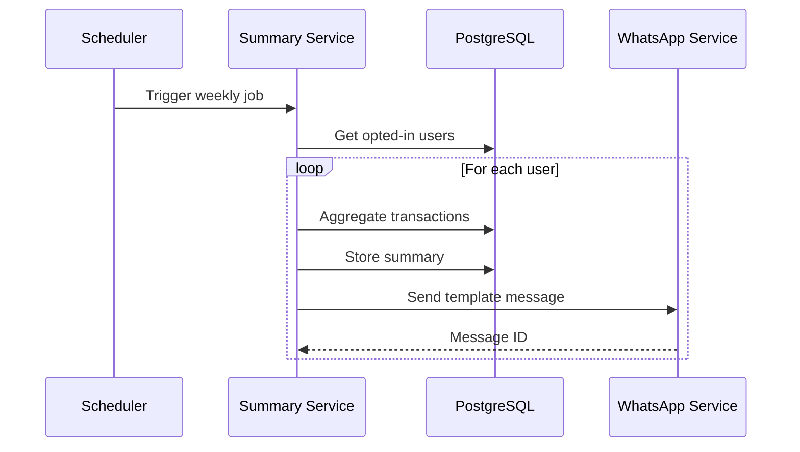

# SpendManager Architecture

## Overview

SpendManager is a privacy-first money tracking system for India that automatically captures transaction notifications and provides AI-powered insights.

## System Architecture

## Component Details

### Android App

#### NotificationListenerService
- Captures notifications from user-selected financial apps
- No foreground service notification (silent operation)
- Play Store compliant (no SMS permissions in Play flavor)

#### Redactor
On-device privacy protection:
- Masks account numbers (keeps first 2 and last 2 digits)
- Masks card numbers
- Masks phone numbers
- Masks UTR/reference IDs
- Preserves amount tokens and merchant names

#### Event Queue
- Room database for offline-first operation
- Automatic retry with exponential backoff
- Deduplication by text hash

#### WorkManager
- Periodic sync every 6 hours
- Battery-efficient background processing
- No user-visible notifications

### Backend Services

#### Auth Service
- Phone OTP authentication
- JWT token generation
- Device registration

#### Event Service
- Batch event ingestion
- Deduplication
- Parse status tracking

#### LLM Service
- Provider abstraction (OpenAI, Anthropic, Mock)
- Heuristics-first parsing
- Response caching by text hash
- Cost controls (daily/user budgets)
- Circuit breaker for failures

#### Categorization Service
- Rule-based categorization (90% of cases)
- LLM fallback for unknown merchants
- Indian merchant keyword database

#### Summary Service
- Weekly aggregations
- Category breakdowns
- Top merchants
- Subscription detection

#### WhatsApp Service
- Template message sending
- Webhook handling
- Status tracking

## Data Flow

### Event Ingestion

### Weekly Summary

## Database Schema

### Core Tables
- `users` - User accounts with hashed phone
- `devices` - Registered devices per user
- `consents` - Privacy preferences
- `events` - Raw notification events
- `transactions` - Parsed transaction data
- `weekly_summaries` - Aggregated summaries

### Supporting Tables
- `otp_requests` - OTP verification
- `parse_cache` - LLM result cache
- `token_usage` - Cost tracking
- `whatsapp_send_logs` - Message delivery logs

## Security Model

### Data Protection
- Phone numbers hashed for storage
- Raw text only stored if user opts in
- On-device redaction by default
- No PII in logs

### Authentication
- Phone OTP verification
- JWT with 30-day expiry
- Device binding

### API Security
- Rate limiting (100 req/min)
- Request validation with Zod
- CORS restrictions in production

## Privacy Modes

### Local-Only Mode (Default)
- All data stays on device
- No cloud features
- Basic local categorization

### Cloud AI Mode
- Redacted text uploaded
- AI parsing enabled
- Weekly summaries available

### Upload Raw Mode (Opt-in)
- Full text uploaded
- Better accuracy
- User explicitly enabled
